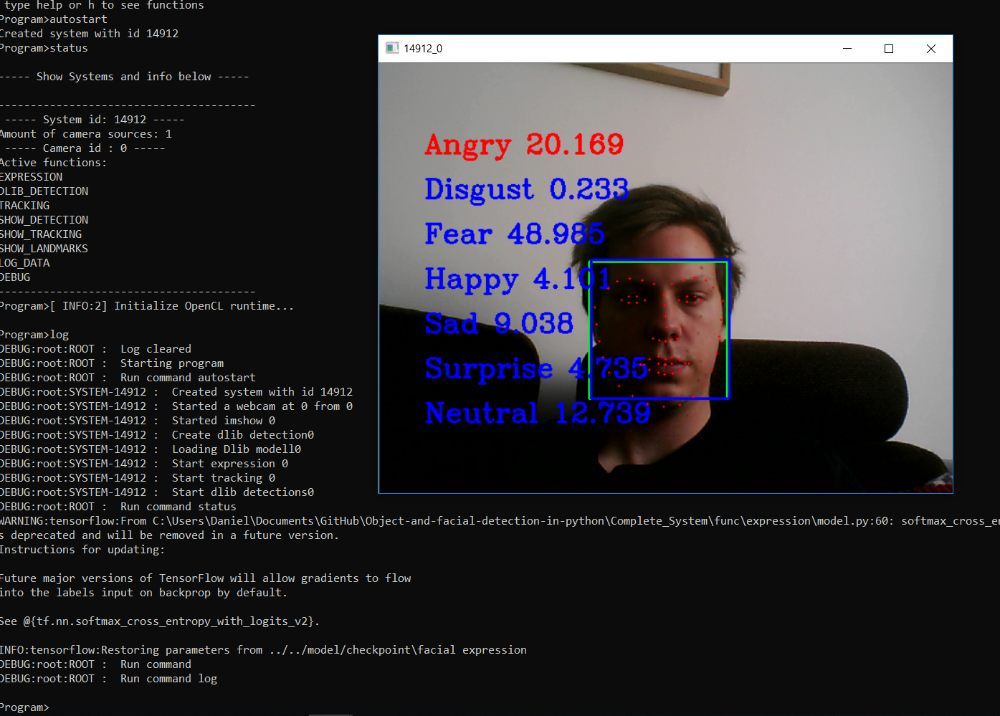

# Facial-detection-and-functionallity-in-python

This repo contains, training material, dlib implementation and tensorflow implementation.
Too large files (mostly models) is ignored due to Github limitations, the models can be found in github-repos linked in learning folder readme.

# Training Material
See folder Learning & Documentation.
In the folder Learning & Documentation show my learning process of object detection, facial detection and how to work with tensorflow and dlib. Repos used to develop code in this repo is linked in Learning-folder README.

# Dlib
See dlib folder.
Here I share a singel and multi threaded dlib solution for facial detection.
I am using code from several other repos with my code here.

This is how the dlib program look like during execution.

# Tensorflow
See tensorflow folder.
Here I share a singel and multi threaded tensorflow solution for facial detection and some functions like skin_color.
I am using code from several other repos with my code here.

This is how the tf program look like during execution.

# Complete System Implementation
This is my own implementation if a test system with a parse-controller. The system architecture is described by the image below. Here follows a short explaination of the architecture. Start starts the parseController that initiate the system. Shared_Variables is the Shared and centered node class that handle all data shared in the program. First of there is a read thread that reads images from a camera stream. These images are then sent to detection and tracking when renewed. The result is returned to shared_variables. Shared_variables then invoke the on_set_frame listener and execute activated functions on seperate threads. Last the frame is sent to Visualize class that show the image. This is a multithreaded implementation and I recommend to run it on a high preformance computer.

As seen in the architecture several extra functions has been added, most relevant are (feel free to add more):

* blink frequency - intresting to know if someone is tierd
* age/gender estimation - just for fun
* expressions - intresting to know if someone is struggling
* skincolor - to see if there are any skin color changes in realtime.
* logger - log system events in data.log
* config - use settings in config.ini (i recommend editing this and use command autostart)
* parse-controller - a controller that lets you controll program from terminal
* flipp-test - a method to flipp camera of detection not found
* energy-save - do less detections missed alot of detections

If it is hard to understand how to use the parse-controller type help or h for some extra information. Let me know if something is hard to understand.
All models used most be downloaded from github repon linked in code!

Here are some example images:

# Known issues
At this time there are some known issues with the complete system:
* Only one of the major functions can run at a time due to Keras using several models on same session.
* SKIN_COLOR doesn't use an instance
* Expression uses deprecated models
